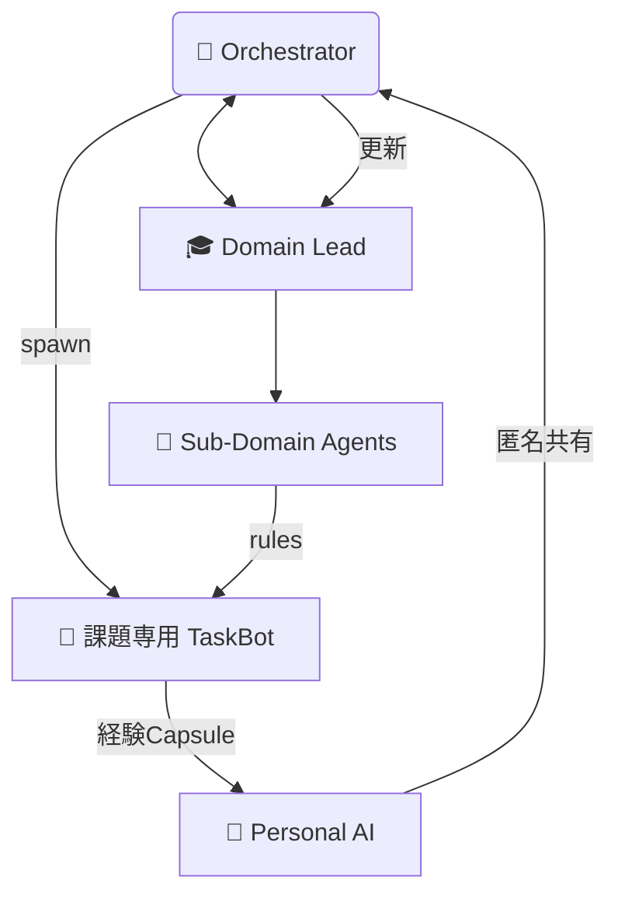

# AI‑Driven Community Orchestration for Shibuya Open Data

**子育て・交通・健康など多様な地域課題を、  
“小さなコミュニティ” と AI が協調して解決する実証プラットフォーム**

---

## 1️⃣ プロジェクト概要
- 対象の行政課題： [東京都知事杯 Open Data Hackathon 2025 渋谷区:多様な主体の参画を促すデータ利活用アイデア](https://odhackathon.metro.tokyo.lg.jp/issues/)
- 詳細：渋谷区では、区民や民間等の多様な主体による課題解決や施策立案への参画を促進するため、地域の現状や課題を可視化する「SHIBUYA CITY DASHBOARD」を公開している。昨年度は渋谷ハチ公大学において、同ツールを活用した体験型講座を実施した。今後さらに利活用を促進するにあたり、教育・地域活動・防災等の様々な場面における活用シーンについて、幅広い提案を募集する。
- 解決策: 数人規模のスモールコミュニティが、自分たちの関心事を深掘り → 横串で学び合う “共助の知識循環” を AI で実装する  

---

## 2️⃣ なぜ“小さなコミュニティ”が鍵か？

| 分散維持のメリット | ネットワーク化のメリット |
|-------------------|--------------------------|
| ✓ 全員が話せる → **深い熟議** | ✓ 他グループの視点が流入 → **多様な仮説** |
| ✓ 負担が小さい → **参加継続** | ✓ 弱い紐帯が橋渡し → **情報・支援が拡散** |
| ✓ 複数並列運転 → **実験速度UP** | ✓ ひとつが止まっても **全体は止まらない** |

---

## 3️⃣ マルチエージェント構造 ＆ 知識循環



- **オーケストレーション層**: マッチング･派遣･KPI監視  
- **専門分野層**: 代表(L1)とサブドメイン(L2)で判断軸を管理  
- **コミュニティ/タスク層**:  
  - *TaskBot* … 課題ごとに即席生成される支援AI  
  - *コミュニティ専属Bot* … 長期活動を伴走  
- **パーソナルAI層**: 参加者各自が経験ルールを蓄積 → 次の課題で “支援サポーター” に昇格  

知識は **「判断 → 結果 → 検証 → 補正」** を多層で回り、  
良質なルールは署名付きで昇格・共有されます。

---

## 4️⃣ ユーザー体験フロー（子育て MVP 例）

1. LINE で課題を投稿 → Orchestrator が「夜間相談」タグを検知  
2. Childcare Lead が `TaskBot_NightFAQ` を生成し、LINE/Slack で FAQ 支援開始  
3. 再質問なし率が 80 %→ 成功ルールを昇格、パーソナルAIにも保存  
4. 別の園で同様課題が発生 → 経験者のパーソナルAI + ルールを推薦し応援

---

## 5️⃣ 技術スタック & フォルダ

| レイヤ | 技術 |
|--------|------|
| LLM / Agent | OpenAI GPT‑4o, LangChain |
| MCP Server  | FastAPI / Flask |
| Data Store  | DuckDB + Parquet |
| Front       | LINE Messaging API / Slack App |
| Orchestrator| Redis Streams, WebSockets |

```
project-root/
├ apps/ (orchestrator, domain_leads, community_bots,…)
├ data/ (parquet, duckdb, schemas)
├ docs/handbook/
└ infrastructure/docker-compose.yaml
```

---

## 6️⃣ ブランチ一覧

| ブランチ | テーマ | ステータス |
|----------|------------------|------------|
| `hachiko-bus` | ハチ公バス            | 🔍 検討中    |
| `sprout`      | 子育て支援            | 🔍 検討中    |
| `active-life` | 健康・スポーツ支援    | 🔍 検討中    |

---

## 7️⃣ 用語集
- **判断軸 (Ruleset)** … 「条件→すべき行動」を定義した YAML / JSON  
- **弱い紐帯** … 知人レベルの緩い関係が情報を橋渡しする Granovetter 理論  
- **MCP (Model Context Protocol)** … 外部データ・ツールを LLM が安全に呼ぶ仕様  


---

ライセンス: MIT
