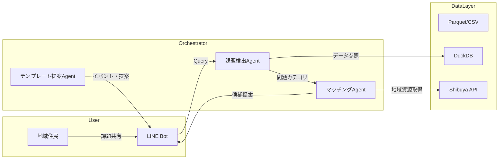

# 03_SystemGuide_kenko_sports.md

## システム全体構成（MVP）



---

## モジュール構成

| モジュール | 説明 |
|------------|------|
| **課題検出 Agent** | Shibuya Dashboard の統計やユーザーの投稿内容から運動・健康の地域課題を抽出 |
| **マッチング Agent** | 居住地・時間帯・年齢などから運動施設やコミュニティ候補を選定 |
| **テンプレート提案 Agent** | イベント開催テンプレートやLINE通知文などを地域ごとに最適化生成 |
| **Data Layer** | DuckDB による軽量 DB・CSV or Parquet による統計の格納・加工 |
| **コミュニケーション層** | LINE Messaging API or Web UI で住民と応答・フィードバック収集 |

---

## フォルダ構成（MVP）

```
project-root/
├── apps/
│   ├── analyzer/         # 課題検出Agent
│   ├── matcher/          # 地域マッチングAgent
│   └── notifier/         # LINE通知・生成系
├── data/
│   ├── dashboard.parquet # 渋谷の運動・健康データ
│   └── facility.csv      # 地域の運動施設・イベント
├── docs/
│   └── handbook/         # このファイル群
└── docker-compose.yml
```
