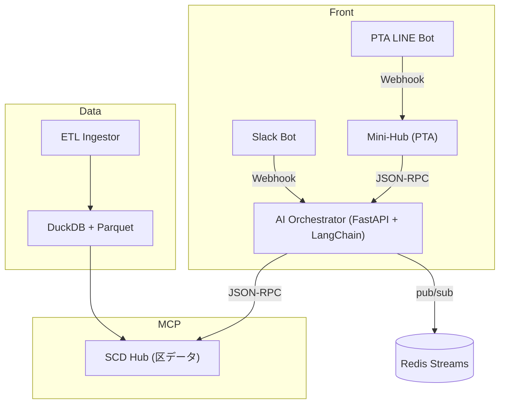

# 03_SystemGuide（子育て版）
*更新日: 2025-07-08*

## 1. システム全体像


## 2. 追加・変更点
| コンポーネント | 機能追加内容 |
|---------------|-------------|
| **Resources** | `waiting_children`, `night_chatlog`, `playground_defect` |
| **Tools** | `pushLineKids(message)`, `generateFAQ()` |
| **Agents** | *NeedWatch*（待機児童ピーク検知）<br>*FAQBuilder*（相談ログ→FAQ） |
| **Schemas** | `waiting.json`, `chatlog.jsonl` |

### 2.1 MCP 定義例
```jsonc
{
  "id":"waiting_children",
  "version":"v202507",
  "schema":"data/schemas/waiting.json",
  "location":"file://data/parquet/waiting_children_202507.parquet"
}
```

## 3. データモデル
### 3.1 waiting_children.parquet
`year_month` / `age_group` / `waiting` / `capacity`

### 3.2 night_chatlog.jsonl
```json
{"timestamp":"2025-07-01T23:10:00Z",
  "user_id":"Uxxx",
  "msg":"申請方法が分かりません",
  "status":"unanswered"}
```

## 4. ワークフロー詳細
| 手順 | イベント | 実処理 |
|------|---------|--------|
| 1 | ETL 完了 (`ETL_DONE`) | Ingestor → waiting_children 更新 |
| 2 | ピーク検知 (`PEAK_DETECTED`) | NeedWatch → Slack/LINE 通知 |
| 3 | 相談投稿 (`NEW_CHATLOG`) | LINE Bot → MiniHub JSONL append |
| 4 | FAQ 生成 | FAQBuilder → markdown FAQ ＋ LINE Push |
| 5 | 効果測定 | 翌月 ETL → 未回答率算出 |


## 5. フォルダ構成差分
```text
project-root/
├─ apps/
│  ├─ orchestrator/
│  │   ├─ src/
│  │   │   ├─ api.py
│  │   │   └─ agents/
│  │   │       ├─ trend_watch.py
│  │   │       ├─ hypo_draft.py
│  │   │       ├─ test_runner.py
│  │   │       ├─ need_watch.py
│  │   │       └─ faq_builder.py
│  │   ├─ prompts/
│  │   ├─ workflows/
│  │   └─ Dockerfile
│  ├─ scd_hub_server/
│  │   ├─ src/
│  │   │   ├─ mcp_server.py
│  │   │   └─ tools/
│  │   │       ├─ poster.py
│  │   │       └─ generate_faq.py
│  │   └─ Dockerfile
│  ├─ minihub/
│  │   ├─ src/
│  │   │   ├─ mcp_server.py
│  │   │   └─ tools/
│  │   │       └─ push_line_kids.py
│  │   ├─ resources/
│  │   │   └─ night_chatlog.jsonl
│  │   └─ Dockerfile
│  ├─ ingestor/
│  │   ├─ src/
│  │   │   └─ ingest.py
│  │   └─ Dockerfile
│  └─ bots/
│      ├─ line_bot/
│      │   ├─ src/
│      │   │   └─ main.py
│      │   └─ Dockerfile
│      └─ slack_bot/
│          ├─ src/
│          │   └─ main.py
│          └─ Dockerfile
├─ data/
│  ├─ parquet/
│  │   ├─ bus_ridership_*.parquet
│  │   ├─ waiting_children_*.parquet
│  │   └─ playground_defect_*.parquet
│  ├─ duckdb/
│  │   └─ shibuya.db
│  └─ schemas/
│      ├─ bus_ridership.json
│      ├─ waiting.json
│      ├─ chatlog.json
│      └─ playground_defect.json
├─ docs/
│  ├─ handbook/
│  │   ├─ 01_ProblemBook_kosodate.md
│  │   ├─ 02_ServiceConcept_kosodate.md
│  │   └─ 03_SystemGuide_kosodate.md
│  ├─ mcp/
│  │   └─ manifest.json
│  └─ architecture/
│      └─ overview.drawio
├─ infrastructure/
│  ├─ docker-compose.yaml
│  └─ terraform/
├─ tests/
│  └─ ...
├─ scripts/
│  └─ smoke_test.sh
└─ README.md

```

> **ポイント**  
> - `apps/orchestrator/src/agents/` に子育て専用エージェント `need_watch.py` と `faq_builder.py` を追加。  
> - `apps/scd_hub_server/tools/generate_faq.py` が `generateFAQ()` MCP ツール。  
> - `data/parquet` に子育て専用 Parquet を格納。  
> - `docs/mcp/manifest.json` に Resources/Tools を一元管理。  


## 6. 開発・起動手順
```bash
# 依存インストール
poetry install

# 起動
docker compose -f infrastructure/docker-compose.yaml --profile kosodate up -d

# ヘルスチェック
curl http://localhost:8000/healthz  # 200 OK
```

## 7. 拡張予定
- Redis → Kafka 置換でスケール対応  
- `child_accident_hotspots` リソース追加  
- GKE / Cloud Run へ本番デプロイ  

