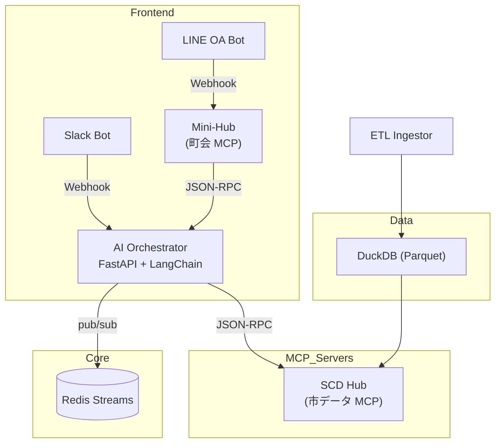

# 03 SystemGuide – 技術構成と実装方針  
*Updated: 2025-07-07*

## 0. ドキュメントの目的
本書は **「渋谷ハチ公バス × 町会 AI EBPM MVP」** の技術仕様書です。  
エンジニアがコードを読み／書き始める時に **「どのサービスが何を担い、どこを変更すればよいか」** を 1 冊で把握できるように記載しています。

## 1. 全体アーキテクチャ


## 2. コンポーネント詳細
| ID | サービス | 主責務 | 主 I/O |
|----|----------|--------|--------|
| A | **Ingestor** | PowerBI CSV → Parquet → DuckDB、Manifest version 更新 | CSV / Parquet |
| B | **SCD Hub** | MCP Resource `bus_ridership`, Tool `createPoster` | JSON‑RPC |
| C | **Mini‑Hub** | MCP Resource `feedback`, Tool `pushLINE` | JSON‑RPC / LINE |
| D | **Orchestrator** | TrendWatch / HypoDraft / TestRunner, REST API | Redis / JSON‑RPC |
| E | **LINE Bot** | 投稿 → MiniHub、Push 通知 | LINE API |
| F | **Slack Bot** | アラート & Slash Cmd | Slack API |
| G | **Redis Streams** | イベントバス | Streams |
| H | **DuckDB** | `ridership` table | Parquet |

## 3. データモデル
### 3.1 ridership
カラム: `date` | `route_id` | `route_name` | `passengers`

### 3.2 feedback.jsonl
フィールド: `timestamp` | `user_id` | `route_id` | `text` | `tags[]`

## 4. ワークフロー
1. ETL → `ETL_DONE`  
2. TrendWatch → `ANOMALY_DETECTED`  
3. Slack Alert / LINE 招集  
4. 住民投稿 → `NEW_FEEDBACK`  
5. HypoDraft 仮説生成  
6. TestRunner 施策実行  
7. 翌月 効果測定  

## 5. フォルダ構成
```
docs/handbook/03_SystemGuide.md
apps/{orchestrator, scd_hub_server, minihub, ingestor, bots}
data/{parquet, duckdb, schemas}
infrastructure/docker-compose.yaml
```

## 6. 開発手順
```bash
docker compose up -d
curl localhost:8000/healthz
```

## 7. 今後の拡張
- Redis → Kafka  
- 事故ホットスポット Resource 追加  
- GKE へ移行

