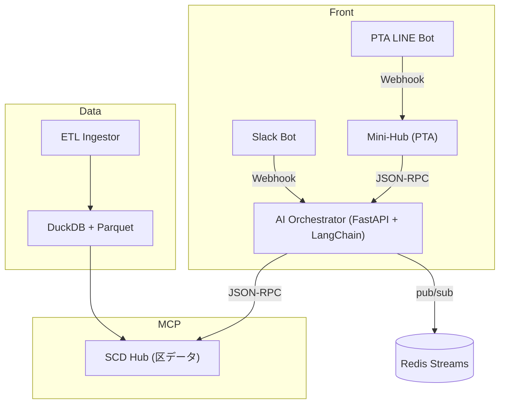

# 03_SystemGuide（子育て版）
*更新日: 2025-07-08*

## 1. システム全体像


## 2. 追加・変更点
| コンポーネント | 機能追加内容 |
|---------------|-------------|
| **Resources** | `waiting_children`, `night_chatlog`, `playground_defect` |
| **Tools** | `pushLineKids(message)`, `generateFAQ()` |
| **Agents** | *NeedWatch*（待機児童ピーク検知）<br>*FAQBuilder*（相談ログ→FAQ） |
| **Schemas** | `waiting.json`, `chatlog.jsonl` |

### 2.1 MCP 定義例
```jsonc
{
  "id":"waiting_children",
  "version":"v202507",
  "schema":"data/schemas/waiting.json",
  "location":"file://data/parquet/waiting_children_202507.parquet"
}
```

## 3. データモデル
### 3.1 waiting_children.parquet
`year_month` / `age_group` / `waiting` / `capacity`

### 3.2 night_chatlog.jsonl
```json
{"timestamp":"2025-07-01T23:10:00Z",
  "user_id":"Uxxx",
  "msg":"申請方法が分かりません",
  "status":"unanswered"}
```

## 4. ワークフロー詳細
| 手順 | イベント | 実処理 |
|------|---------|--------|
| 1 | ETL 完了 (`ETL_DONE`) | Ingestor → waiting_children 更新 |
| 2 | ピーク検知 (`PEAK_DETECTED`) | NeedWatch → Slack/LINE 通知 |
| 3 | 相談投稿 (`NEW_CHATLOG`) | LINE Bot → MiniHub JSONL append |
| 4 | FAQ 生成 | FAQBuilder → markdown FAQ ＋ LINE Push |
| 5 | 効果測定 | 翌月 ETL → 未回答率算出 |

## 5. フォルダ構成差分
```
apps/
  scd_hub_server/tools/generate_faq.py
data/
  schemas/waiting.json
  schemas/chatlog.json
```

## 6. 開発・起動手順
```bash
# 依存インストール
poetry install

# 起動
docker compose -f infrastructure/docker-compose.yaml --profile kosodate up -d

# ヘルスチェック
curl http://localhost:8000/healthz  # 200 OK
```

## 7. 拡張予定
- Redis → Kafka 置換でスケール対応  
- `child_accident_hotspots` リソース追加  
- GKE / Cloud Run へ本番デプロイ  

